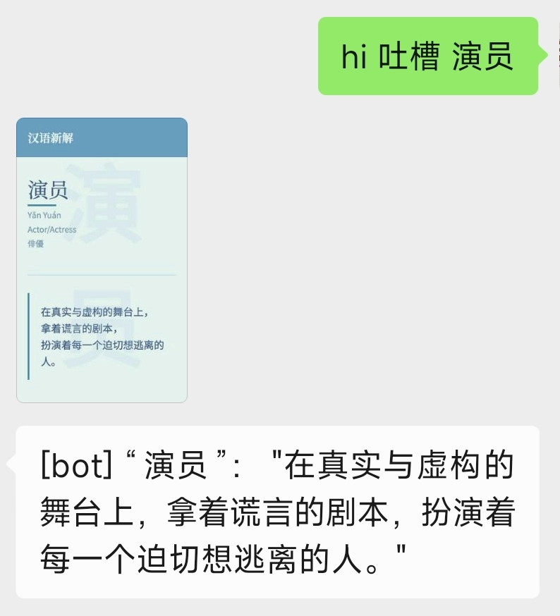

# ChinesePUA 插件

ChinesePUA 是一个为 chatgpt-on-wechat 设计的插件,灵感来源于李继刚和云中江树的创意。它能够为中文词语提供幽默而富有创意的新解释,并生成一张方便分享的文字卡片。此外，它还可以生成精美的社交名片。

特别感谢云中江树大神收录 [飞书文档: 玩转"汉语新解"？我用通义AI直出爆款文字卡片](https://langgptai.feishu.cn/wiki/WKaEwX5LMirfJlkenf6cKGDGnJg)

## 功能

- 输入 "吐槽 [词语]" 或者 "pua [词语]" 即可获得该词语的幽默新解释
- 自动生成与新解释相关的图片
- 采用李继刚和云中江树两位大神无私分享的prompt [飞书文档: 精美卡片-汉语新解（玩梗高手）](https://tffyvtlai4.feishu.cn/wiki/HvkuwNcKxiqvLKk5o9rcRjfjn1u)
- 输入 "设计 [个人信息]" 或 "名片 [个人信息]" 生成精美的社交名片 参照云中江树大神的 [飞书文档: 国内 AI 也能直出高颜值名片](https://langgptai.feishu.cn/wiki/WG7OwFMcOi1GQ1kHIsjctEUnnC1)

## 使用方法

1. 在聊天中输入 "吐槽 [词语]",例如 "吐槽 加班"
2. 插件会返回该词语的幽默新解释和文字卡片
3. 输入 "设计 [姓名] [职位] [公司] [联系方式]" 或 "名片 [姓名] [职位] [公司] [联系方式]" 生成社交名片

## 样例

以下是使用本插件生成的文字卡片样例：

社交名片样例：

输入 `设计 张三 法外狂徒 法学教授 普及法律知识 头像：https://s1-imfile.feishucdn.com/static-resource/v1/v2_493bb53e-6bb9-4910-a48c-da17a3d49aag~ 个人主页：https://langgptai.feishu.cn/wiki/WG7OwFMcOi1GQ1kHIsjctEUnnC1`

## 安装

1. 将插件文件夹复制到 `plugins` 目录下
2. 安装playwright `pip install playwright`
3. 安装chromium `playwright install chromium`
4. 配置相关的key和base
4. 在 `config.json` 中启用插件
5. 重启 chatgpt-on-wechat

## 配置

可以在 `config.json` 中进行以下配置:

- `api_key`: API密钥
- `api_base`: API基础URL, 例如 `https://api.openai.com/v1`
- `api_model`: 使用的API模型, 默认 `gpt-4o-mini`

## 注意事项

- 本插件仅供娱乐使用,生成的内容可能具有讽刺或夸张性质
- 请遵守相关法律法规,不要生成违法或不当内容
- 本插件依赖于 `chatgpt-on-wechat` 项目，请确保你已经安装了该项目

## 贡献

欢迎提交 Issue 或 Pull Request 来帮助改进此插件!

## 许可证

MIT License

## 更新日志

### 0.3版本
- 新增"设计"和"名片"触发词功能
- 支持生成精美的社交名片，包含姓名、职位、公司和联系方式等个人信息
- 优化图片生成算法，提高名片设计的美观度和专业性
